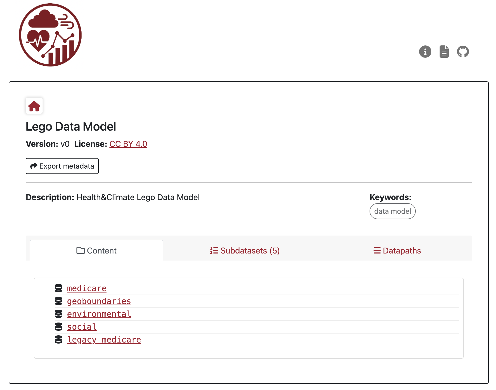
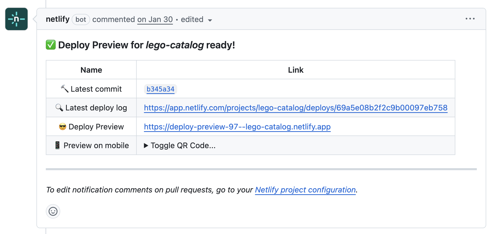

# Lego Data Catalog

This repository contains JSON Schema metadata to build the Lego catalog. 

Use this link to view the catalog: https://lego-catalog.netlify.app/#/dataset/lego/v0

  

**For reviewers:** When a PR adds or updates a dataset card, **review it from a user's perspective**: does the entry look correct and provide the information someone would need to understand and use the dataset? 

> A preview deployment is available for each PR, allowing you to verify changes without running any local builds.

Your primary task is to verify the changes through the preview deployment. You don't need to review code or run the build process. The aim is to ensure the catalog displays correctly and contains the expected changes.

## Review Guide

This guide walks reviewers through the process of validating pull requests (PRs) that update our dataset catalog. Most changes involve adding, removing, or updating dataset entries.

### Steps

1. **Read the linked issue** Ask the PR creator to point you to the issues that are resolved in the PR, they should appear in the issues tab in Github.
2. **Open the deploy preview** Open the assigned PR in Github. In the **conversation** tab, you should see a comment from the **netlify bot** with links to the **Deploy Preview**. Navigate the staged website, identify where the changes are reflected in the catalog preview.

<!-- TODO: screenshot showing where to find the deploy preview link on a PR -->
 

3. **Check dataset cards as a user would:** If possible, try to access the files in the cluster and validate they are correctly stored and named. In the catalog make the following checks:
   - Is the title and description clear and accurate?
   - Are metadata fields filled in (not empty or placeholder)?
   - Do links work (GitHub repo, DOI, documentation)?

    The "View on Github" botton  links to the dataset's associated code. 

    The Dataverse DOI of these datasets is shown. Use the "Cite" botton to display an example citation, or click on the "DOI" link to go to the associated Dataverse entry.

   - Does the data dictionary make sense?
   - Is the folder structure reflecting the child datasets, does the parent list them correctly?
   - Make sure `environmental` and `social` datasets  include "Temporal Coverage" and "Spatial Coverage" elements in the Properties display.
   
 

4. **Submit your review** on GitHub — approve, comment, or request changes.

<!-- TODO: screenshot of a well-filled dataset card on the deployed site -->

